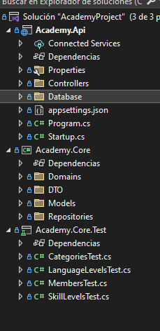
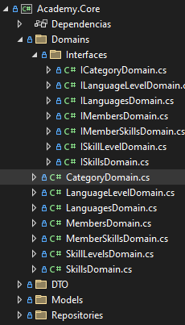

<span style="font-family: Times New Roman;">
<span style="text-align: justify">
<span style="font-size: medium;">

# Utilizar una base de datos en un proyecto .NET Core:
- En el archivo `appsettings.json`, se puede configurar la conexión a la base de datos en la sección "ConnectionStrings". Por ejemplo:


  ```json
  "ConnectionStrings": {
  "DefaultConnection": "Server=(localdb)\mssqllocaldb;Database=[nombre];Trusted_Connection=True;MultipleActiveResultSets=true",
  "OtraBase": "Server=server2;Database=Base;Trusted_Connection=True;MultipleActiveResultSets=true"
  }
 
- *"DefaultConnection"* es el nombre a mapear.

- En el proyecto *(Proyect>Manager)*, se deben instalar los siguientes paquetes de Nuget:
    - Entity Framework Core
    - Entity SQL Server Core
    - Entities Tools Core
    
- En el archivo `Config/DBContext.cs`, se define la clase `DBBookContext` que extiende de `DbContext` y se utiliza para interactuar con la base de datos. 
 Se define una propiedad `DbSet<Book> book`.
 ``` c #
   public class DBBookContext : DbContext
      {
          public DBBookContext(DbContextOptions<DBBookContext> options):base(options) 
          {          
          }
          public DbSet<Book> books { get; set; }
      }
  }
  ```
  
En el archivo `Program.cs` se añade el siguiente código para establecer la conexión a la base de datos:
  ``` c #
      builder.Services.AddDbContext<DBBookContext>(options =>
      {
          options.UseSqlServer(builder.Configuration.GetConnectionString("DefaultConnection"));
      });
  ```
  
  En la consola de **Package Manager** se pueden ejecutar los siguientes comandos:
 - add-migration [nombreMigracion] se utiliza para crear un archivo de migraciones
 - update-database se utiliza para crear o actualizar la base de datos
    
  **Para habilitar CORS, se debe añadir el siguiente código en Program.cs**
  ``` c #
      builder.Services.AddCors(options =>
      {
          options.AddPolicy("MiPolitica", app =>
          {
              app.AllowAnyOrigin();
              app.AllowAnyHeader();
              app.AllowAnyMethod();
          });
      });

    app.UseCors("MiPolitica");
  ```
# CRUD
``` c #
using BooksApi.Config;
using BooksApi.Models;
using Microsoft.AspNetCore.Mvc;
using Microsoft.EntityFrameworkCore;

namespace BooksApi.Controllers {
    public class BookController : Controller {
        private readonly DBBookContext _context;

        public BookController(DBBookContext context) {
            _context=context;
        }

        [HttpPost("save")] public async Task<ActionResult>Post(Book book) {
            _context.Add(book); //añadir al contexto el libro
            await _context.SaveChangesAsync();

            return Ok(book);

        }
```
**Importante:**
Si se realiza un POST desde una aplicación externa y no desde swagger, necesitamos añadir en el controlador -> *[FromBody]*

*El codigo quedaría:*
 <code>public async Task<ActionResult> NuevoCliente([FromBody] Cliente cliente)</code>


```c #

        [HttpGet("list")] public async Task<ActionResult<List<Book>>>Get() {
            return await _context.books.ToListAsync<Book>();

        }

        [HttpPut("/update/{id}")] public async Task<ActionResult>Put(int id, Book book) {
            _context.Entry(book).State=EntityState.Modified;
            await _context.SaveChangesAsync();
            return Ok(book);
        }

        [HttpDelete("/delete/{id}")] public async Task<ActionResult>Delete(int id) {
            var libro=await _context.books.FindAsync(id);

            _context.Remove(libro);

            await _context.SaveChangesAsync();

            return NoContent();
        }

        [HttpGet("get/{id}")] public async Task<ActionResult<Book>>GetLibro(int id) {
            return Ok(await _context.books.FindAsync(id));
        }
    }}

```


# .NET Structure
**Data/Database**: This folder should contain the Entity Framework related classes, <u>including the context</u> class that represents the database, the entity classes that represent the tables in the database, and any other data-related classes, such as repository classes or custom DbSets. 

**Models/Domains**: This folder should contain the classes that represent the domain model of your application. These classes should be independent of the data access layer and represent the objects and business logic of the application. 

**Repositories**: This folder should contain the repository classes that implement the data access logic for your application. The repository classes should use the Entity Framework context to perform database operations and return data to the application. 

**Services**: This folder should contain the service classes that implement the business logic of the application. The service classes should use the repository classes to perform data access operations and return data to the controllers. 

**DTO**: Objects with not all the properties to work with and send to the front.

**Controllers**: This folder should contain the controllers that handle incoming HTTP requests and return HTTP responses. The controllers should use the service classes to perform business logic operations and return data to the views. 

**Views/Front**: This folder should contain the views that render HTML pages based on the data provided by the controllers. 

**Migrations**: This folder should contain the Entity Framework migrations that are used to manage the changes to the database schema over time.Tests: This folder should contain the unit tests for your application, including tests for the data access layer, the repository classes, the service classes, and the controllers.

*Estructure example of a real project*:




**Model!=Service** || **Model=Domain**


[Buenas prácticas WebApi .NET](https://code-maze.com/aspnetcore-webapi-best-practices/)

## Division examples - Good practices

#### Database (DBContext)
```c #
using backNet.Models;
using Microsoft.EntityFrameworkCore;

namespace backNet.Config
{
    public class DBApiContext : DbContext
    {
        public DBApiContext(DbContextOptions<DBApiContext> options) : base(options)
        {

        }

        public DbSet<Expends> Expends { get; set; }

    }
}
```

#### Model

``` c #
using System.ComponentModel.DataAnnotations.Schema;
using System.ComponentModel.DataAnnotations;

namespace backNet.Models
{
    public class Expends
    {

        [Key]
        [DatabaseGenerated(DatabaseGeneratedOption.Identity)]
        public int Id { get; set; }
        public string Type { get; set; }
        public int Amount { get; set; }
        public string? Date { get; set; } //Campo que puede quedar vacío y llevar nulos, los otros 3 son obligatorios.

        //private string User {get; set;} ->  Habría que mirar de hacer un login
    }
}

```

#### Interfaz Repository

``` c #
using backNet.Models;
using Microsoft.AspNetCore.Mvc;

namespace backNet.Repositories.Interfaces
{
    public interface IExpendsRepository
    {
         Task<List<Expends>> GetExpends();
         Task PostExpend(Expends expend);
         Task DeleteExpend();
    }
}

```

#### Repository Methods

``` c #
using backNet.Config;
using backNet.Models;
using backNet.Repositories.Interfaces;
using Microsoft.EntityFrameworkCore;

namespace backNet.Repositories
{
    public class ExpendsRepository: IExpendsRepository
    {

        private readonly DBApiContext _context;

        public ExpendsRepository(DBApiContext context)
        {
            _context = context;
        }

        public async Task<List<Expends>> GetExpends()
        {
            return await _context.Expends.ToListAsync();
        }

        public async Task PostExpend(Expends expend)
        {
            _context.Expends.Add(expend);
            await  _context.SaveChangesAsync();
        }


        public async Task DeleteExpend()
        {
            _context.Expends.ExecuteDelete();
            await _context.SaveChangesAsync();
        }
    }
}

```

#### Controller

``` c #
using AutoMapper;
using backNet.DTO;
using backNet.Models;
using backNet.Repositories.Interfaces;
using Microsoft.AspNetCore.Mvc;

namespace backNet.Controllers
{
    [Route("/api")]
    public class ExpendsController : Controller
    {

        private readonly IExpendsRepository _expendsRepository;
        private readonly IMapper _mapper;


        public ExpendsController(IExpendsRepository expendsRepository, IMapper mapper)
        {

            _expendsRepository = expendsRepository;
            _mapper = mapper;
         }

            [HttpPost("save")] //Endpoint-> https://localhost:7023/api/save
        public async Task<ActionResult>Create([FromBody] ExpendsDTO createdExpendsDTO){

                var expend = _mapper.Map<Expends>(createdExpendsDTO);

                expend.Type = createdExpendsDTO.Type;
                expend.Amount= createdExpendsDTO.Amount;
                expend.Date= createdExpendsDTO.Date;

                await _expendsRepository.PostExpend(expend);
                return Ok(expend);

            }

        [HttpGet("getExpends")] //Endpoint-> https://localhost:7023/api/getExpends
        public async Task<List<ExpendsDTO>> GetExpends()
        {
            var expends= await _expendsRepository.GetExpends();
            return _mapper.Map<List<ExpendsDTO>>(expends);
           
        }

        [HttpDelete("clearExpends")] //Endpoint-> https://localhost:7023/api/clearExpends
        public async Task ClearExpends()
        {
            await _expendsRepository.DeleteExpend();


        }

    }
   
    
}

```


# Automapper in .NET Core
This guide will show you how to set up Automapper for mapping between objects in a .NET Core application.

### Installing Automapper
To install Automapper, run the following command in the Package Manager Console:

<code>add package AutoMapper.Extensions.Microsoft.DependencyInjection</code>

### Setting up Automapper
In your Program.cs file, configure Automapper as follows:

<code>builder.Services.AddAutoMapper(AppDomain.CurrentDomain.GetAssemblies());</code>

This will add Automapper to the dependency injection container and make it available for use throughout your application.

### Creating Mapping Profiles
Create a new file, **MappingProfiles.cs**. In this file, you'll define your mapping profiles. A mapping profile is where you define the relationships between objects.

``` c #
namespace XXX.XXX.Helpers;

public class MappingProfiles: Profile {
    public MappingProfiles() {
        CreateMap<Address, AddressDto>();
    }
}
``` 
### Using Automapper in a Controller
In your controller, you can inject an IMapper instance:

``` c #
private readonly IMapper _mapper;

public OperatorsController(IMapper mapper)
{
    _mapper = mapper;
}
``` 
Now, you can use the IMapper instance to map objects. For example:

``` c #
[HttpGet]
public async Task<List<AutorDTO>> Get()
{
    var autores = await context.Autores.ToListAsync();
    return mapper.Map<List<AutorDTO>>(autores);
}
```

Here, the Get method retrieves a list of Autor objects from the database, and then maps them to a list of AutorDTO objects using the IMapper instance.

``` c #
[HttpPost]
public async Task<ActionResult> Post([FromBody] AutorCreacionDTO autorCreacionDTO)
{
    var autor = mapper.Map<Autor>(autorCreacionDTO);
    await context.Autores.AddAsync(autor);
    await context.SaveChangesAsync();
    return Ok();
}
```
In this Post method, Automapper maps the incoming AutorCreacionDTO object to an Autor object. The newly created Autor object is then saved to the database.


