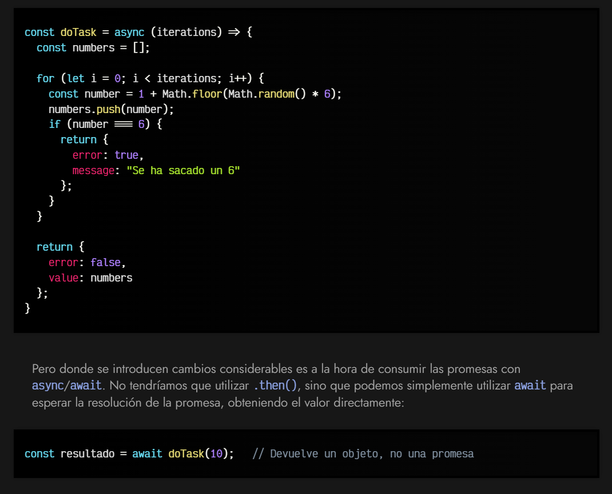
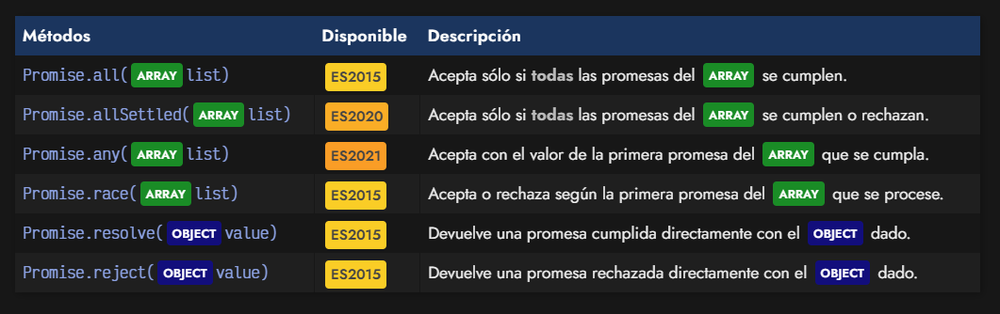
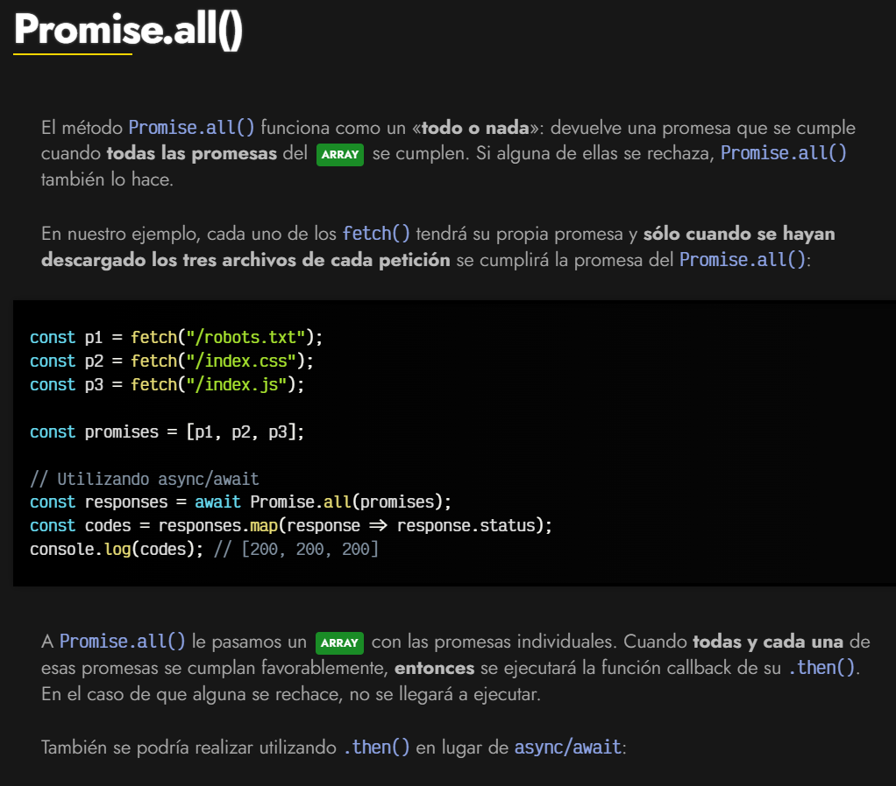

<span style="font-family: Times New Roman;">
<span style="text-align: justify">
<span style="font-size: medium;">

# Conceptos

### Migraciones

Las **migraciones** en programación web se refieren a la gestión y actualización de la estructura de la base de datos de una aplicación web. Se utilizan para mantener la consistencia entre el modelo de datos de una aplicación y la estructura de la base de datos. Se implementan mediante la creación de scripts que describen los cambios necesarios en la estructura de la base de datos y permiten actualizar la base de datos sin tener que intervenir manualmente. Las migraciones facilitan el trabajo en equipo y reducen el riesgo de errores humanos al actualizar la base de datos.


### Variables de entorno

**.env** es un archivo que se utiliza en aplicaciones web para almacenar variables de entorno en un formato de pares de clave-valor. Estas variables de entorno pueden contener información sensible, como contraseñas de bases de datos o claves de API, y se utilizan para configurar la aplicación en tiempo de ejecución. 

**En Python:**
``load_dotenv()`` es una función de la biblioteca de Python "python-dotenv" que carga variables de entorno desde un archivo .env en el directorio base del proyecto y las agrega al entorno de ejecución.


### FilterBy SQLAlchemy
*Filtra directamente realizando la consulta a la base de datos*

La función ``filter_by()`` es un método que se utiliza en SQLAlchemy, una biblioteca de Python para trabajar con bases de datos relacionales, para filtrar registros en una tabla de base de datos a través de una consulta.
  
 
### Git
 - **Merge sin eliminar rama mergeada:** `git merge --no-ff branch-to-merge`


### Asincronía en JavaScript
- [Asincronía Manz.dev](https://lenguajejs.com/javascript/asincronia/que-es/)

**Async-Await**



**Array Promises**





**Angular async & http**

En Angular, puedes usar async y await en funciones para manejar llamadas asincrónicas de manera más limpia y legible. Esto es especialmente útil cuando trabajas con operaciones asíncronas, como solicitudes HTTP, operaciones de lectura/escritura en bases de datos, o cualquier otro proceso que tome tiempo en completarse. Aquí te explico cómo funciona:

Palabra clave async: Puedes declarar una función como async anteponiendo la palabra clave async antes de la palabra clave function. Por ejemplo:

```typescript
async miFuncion() {
  // Código asincrónico
}
```
Palabra clave await: Dentro de una función async, puedes usar la palabra clave await antes de una expresión que devuelve una promesa. Esto pausará la ejecución de la función hasta que la promesa se resuelva o se rechace. Por ejemplo:

```typescript
async obtenerDatos() {
  const resultado = await this.servicio.obtenerDatos();
  // El código aquí se ejecutará después de que la promesa se resuelva
  console.log(resultado);
}
```
En este ejemplo, this.servicio.obtenerDatos() es una función que devuelve una promesa. Usar await en esta llamada permite que el código espere hasta que la promesa se resuelva antes de continuar.

Manejo de errores: Puedes usar try...catch para manejar errores cuando se utiliza await. Si la promesa se rechaza, se generará una excepción que puedes capturar y manejar de la siguiente manera:

```typescript
async obtenerDatos() {
  try {
    const resultado = await this.servicio.obtenerDatos();
    console.log(resultado);
  } catch (error) {
    console.error('Error al obtener datos:', error);
  }
}
```
Esto asegura que los errores se manejen de manera adecuada y no rompan la ejecución del programa.

Retorno de valores asincrónicos: Puedes retornar valores desde funciones async, y estos valores se envolverán automáticamente en una promesa resuelta. Por ejemplo:

```typescript
async obtenerDatos() {
  const resultado = await this.servicio.obtenerDatos();
  return resultado;
}
```
Si llamas a esta función, obtendrás una promesa que se resolverá con el valor de resultado.

Uso en plantillas: En las plantillas de Angular, puedes usar el operador async en las directivas *ngIf y *ngFor para manejar la visualización condicional o la iteración sobre datos asincrónicos.
Por ejemplo, puedes usar *ngIf con una función async en tu plantilla de la siguiente manera:

```typescript
<div *ngIf="condicionAsincronica()"></div>
```

En resumen, el uso de async y await en funciones en Angular simplifica el manejo de operaciones asincrónicas, haciendo que tu código sea más limpio y legible al evitar el anidamiento excesivo de callbacks y promesas.

Pero que retorna un await, una promesa, un objeto?

await retorna el resultado de una promesa. Cuando utilizas await en una función async, estás pausando la ejecución de esa función hasta que la promesa se resuelva o se rechace. El resultado de esa promesa se devuelve como valor. Si la promesa se resuelve exitosamente, el valor de retorno será el valor resuelto de la promesa. Si la promesa es rechazada (por ejemplo, debido a un error), se lanzará una excepción.

En resumen:

Si la promesa se resuelve correctamente, await retorna el valor resuelto de la promesa.
Si la promesa es rechazada, await genera una excepción que puedes manejar usando un bloque try...catch o permitir que se propague como una excepción no capturada.
Aquí tienes un ejemplo para ilustrar esto:

```typescript
async function ejemploAsync() {
  try {
    const resultado = await promesaAsincrona();
    console.log("La promesa se resolvió:", resultado);
  } catch (error) {
    console.error("La promesa se rechazó:", error);
  }
}

function promesaAsincrona() {
  return new Promise((resolve, reject) => {
    setTimeout(() => {
      // Simular una promesa que se resuelve después de un tiempo
      resolve("¡Éxito!");
      // O puedes rechazar la promesa: reject(new Error("¡Error!"));
    }, 1000);
  });
}

ejemploAsync();
```
En este ejemplo, await promesaAsincrona() espera a que la promesa se resuelva y luego retorna el valor resuelto, que en este caso es la cadena "¡Éxito!".

**Y en que casos se devuelve un objeto promesa en el que tenemos que utilizar then, cuando no se usa async y await?**

Las promesas se utilizan comúnmente en JavaScript para manejar operaciones asíncronas. Puedes encontrarte con promesas en varios casos, incluso cuando no estás utilizando async y await. Aquí hay algunos ejemplos de situaciones en las que obtendrás una promesa y necesitarás usar el método .then() para manejar la resolución de esa promesa:

Solicitudes HTTP: Cuando haces una solicitud HTTP utilizando Angular's HttpClient (o cualquier otra librería similar), obtendrás una promesa como resultado. Aquí hay un ejemplo sin async y await:

```typescript
this.httpClient.get('https://api.example.com/data')
  .then(response => {
    // Manejar la respuesta
    console.log(response);
  })
  .catch(error => {
    // Manejar el error
    console.error(error);
  });
```
Operaciones de lectura/escritura en bases de datos: Al interactuar con bases de datos o sistemas de almacenamiento, a menudo se devuelven promesas para representar la finalización de la operación. Esto puede ocurrir en bibliotecas como Firebase o IndexedDB.

```typescript
myDatabase.readData().then(data => {
  // Hacer algo con los datos leídos
}).catch(error => {
  // Manejar el error
});
```

Carga de archivos: Cuando cargas un archivo en una aplicación web, la operación de carga se realiza de forma asíncrona y suele devolver una promesa.

```typescript
uploadFile(file)
  .then(response => {
    // Manejar la respuesta de la carga
  })
  .catch(error => {
    // Manejar errores de carga
  });
  ```

Operaciones de temporización: Al usar funciones como setTimeout o setInterval, no se utiliza async y await, pero aún así obtienes una promesa que puedes usar para manejar la finalización de la temporización.

```typescript
const delay = (ms) => new Promise(resolve => setTimeout(resolve, ms));

delay(1000)
  .then(() => {
    // Este código se ejecuta después de 1 segundo
  });
  ```

En estos casos, aunque no estés utilizando async y await, aún trabajas con promesas y debes usar .then() y .catch() para manejar la resolución y el manejo de errores de esas promesas. La elección de utilizar async y await o métodos .then() depende de tu preferencia y del estilo de programación que desees seguir.

**Y dame un ejemplo de peticiones http pero esta vez con async y await**

Por supuesto, aquí tienes un ejemplo de cómo hacer una solicitud HTTP utilizando async y await en Angular con HttpClient:

```typescript
import { Component, OnInit } from '@angular/core';
import { HttpClient } from '@angular/common/http';

@Component({
  selector: 'app-ejemplo-http',
  templateUrl: './ejemplo-http.component.html',
  styleUrls: ['./ejemplo-http.component.css']
})
export class EjemploHttpComponent implements OnInit {
  responseData: any;

  constructor(private http: HttpClient) { }

  ngOnInit(): void {
    this.obtenerDatos();
  }

  async obtenerDatos() {
    try {
      this.responseData = await this.http.get('https://api.example.com/data').toPromise() 
      //toPromise() está deprecates usar lastValueFrom() o firsValueFrom();
      //import { lastValueFrom, firstValueFrom } from 'rxjs';
      console.log('Datos obtenidos:', this.responseData);
    } catch (error) {
      console.error('Error al obtener datos:', error);
    }
  }
}
```
En este ejemplo:

Importamos HttpClient desde @angular/common/http.

Creamos un método obtenerDatos que está marcado como async. Esto nos permite usar await dentro de la función.

Dentro de obtenerDatos, utilizamos await en this.http.get('https://api.example.com/data').toPromise() para hacer una solicitud GET a la URL proporcionada. toPromise() convierte la observación en una promesa que podemos esperar con await.

Utilizamos un bloque try...catch para manejar posibles errores. Si la solicitud se resuelve correctamente, el resultado se almacena en this.responseData. Si ocurre un error, se captura y se maneja en el bloque catch.

Este es un ejemplo básico de cómo puedes utilizar async y await con HttpClient en Angular para realizar solicitudes HTTP de manera asíncrona y manejar los resultados de una manera más legible y ordenada.


**Ejemplo simple de como consumir la asincronía**
