<span style="font-family: Times New Roman;">
<span style="text-align: justify">
<span style="font-size: medium;">

# Python & Flask
**Índice**
1. [Introducción](#intro)
2. [CRUD](#crud)
3. [Blueprints](#blueprints)
4. [Ejemplo de Arquetipo](#arquetipo)
5. [Habilitar CORS](#habilitarCors)
6. [Relaciones entre tablas](#relacionesTablas)
7. [Hasheo de contraseñas & Login](#hashLogin)
8. [JWT](#jwt)
9. [Headers](#headers)
10. [Tratamiento de respuestas bytes & JSON](#tratamientoRespuestas)
11. [Codigos de Estado y su tratamiento](#codigosEstado)
12. [Redirecciones](#redirecciones)
13. [Timeouts](#timeouts)
14. [Unit Testing](#unitTesting)
15. [DTO](#dto)
16. [Flechas y Lambdas](#flechasylambdas)
17. [Serialización Marshmallow](#serialización)
18. [Subida de archivos (con *chunks*)](#subida)
19. [Enlaces de interés](#enlaces)


<span id='intro'>

#### Creacion de un entorno virtual de python

`python -m venv /path/to/new/virtual/environment`

#### Activar el entorno
`.\[path]\Scripts\Activate`

#### Dependencias a instalar dentro del entorno
`pip install flask flask-sqlalchemy flask-marshmallow marshmallow-sqlalchemy pymysql`

**sqlalchemy:** Esto importa la clase SQLAlchemy del paquete flask_sqlalchemy. SQLAlchemy es una biblioteca de Python para trabajar con bases de datos relacionales. Con Flask-SQLAlchemy, se puede integrar SQLAlchemy en una aplicación Flask de manera sencilla.

**marshmallow:** Esto importa la clase Marshmallow del paquete flask_marshmallow. Marshmallow es una biblioteca de serialización/deserialización de objetos para Python. Flask-Marshmallow es una extensión que proporciona integración con Marshmallow y Flask, lo que permite la serialización y deserialización de objetos en formato JSON.

**marshmallow-sqlalchemy:** es una extensión de Marshmallow que proporciona integración con SQLAlchemy. Se utiliza para definir esquemas de serialización/deserialización de objetos SQLAlchemy y proporciona un método sencillo para la definición de esquemas Marshmallow basados en modelos SQLAlchemy.

**pymysql:** es un controlador de base de datos MySQL para Python. Se utiliza para conectarse a una base de datos MySQL y ejecutar consultas SQL.


<hr>

##### Para que funcione la ejecución de la base de datos hay que agregar:

``` python
with app.app_context():

    db.create_all()

"""
Si queremos que se creen automaticamente las tablas debemos colorcar 
estas líneas de código después de la definición de la clase/clases que van 
a estar mapeadas con la base de datos

Cuando lo hacemos siguiendo el arquetipo, si queremos esta creación automática debemos importar la clase en el *main* (donde se haga el init).
"""
```


##### Recarga automática de los cambios hechos en la API => *(debug=true)*

```python
if __name__ == "__main__":
    app.run(debug=True) 
```

##### Si queremos cambiar el puerto, a este código debemos añadirle:

```python
if __name__ == "__main__":
    app.run(debug=True, port=8080) 
```

`if __name__ == "__main__"` es una construcción comúnmente utilizada en Python para verificar si el archivo actual se está ejecutando como el programa principal (es decir, si es el archivo que se ejecuta cuando se llama desde la línea de comando) o si se está importando como un módulo en otro programa.

Cuando se ejecuta un archivo de Python directamente desde la línea de comando, Python establece la variable __name__ en el valor "__main__". Por lo tanto, la construcción `if __name__ == "__main__"` se utiliza para garantizar que el código dentro de ella solo se ejecute cuando se ejecuta el archivo directamente y no cuando se importa como un módulo en otro programa.

##### Funciones & otras librerías:

- Listar dependencias: <code> pip list </code>
- `from pprint import pprint` : **Pretty Print**

"pprint" es un módulo en Python que proporciona la función "pprint()", que se utiliza para imprimir objetos de manera más legible para los humanos. La función "pprint()" es similar a la función "print()", pero agrega formato y estructura a la salida para facilitar la lectura.


<hr>


<span id='crud'>
#### Ejemplo de controlador y CRUD todo en un mismo documento

```python
from flask import Flask,request,jsonify
from flask_sqlalchemy import SQLAlchemy
from flask_marshmallow import Marshmallow

app=Flask(__name__)
app.config['SQLALCHEMY_DATABASE_URI']='mysql+pymysql://root@localhost/flaskmysql'
app.config['SQLALCHEMY_TRACK_MODIFICATIONS']=False

db=SQLAlchemy(app)
ma=Marshmallow(app)

#Creación del modelo que el URM transformará directamente en una tabla en la base de datos
class Task(db.Model):
    id=db.Column(db.Integer,primary_key=True)
    title=db.Column(db.String(70),unique=True)
    description=db.Column(db.String(100))
    
#Constructor 
    def __init__(self, title, description):
        self.title=title
        self.description=description
        


#Para ejecutar la base de datos tenemos que darle este contexto, sino no funciona.
with app.app_context():
    db.create_all()


#Define una clase "TaskSchema" que define cómo se serializarán y deserializarán las instancias de "Task" 
# (es decir, cómo se convertirán a y desde JSON). Esta clase Marshmallow tiene un atributo "Meta" que especifica 
# qué campos del modelo deben incluirse en la serialización. En este caso, "id", "title" y "description".
class TaskSchema(ma.Schema):
    class Meta:
        fields=('id','title','description')

task_schema=TaskSchema()

#Crea otra instancia de "TaskSchema" con el argumento many=True y la asigna a la variable 
# "tasks_schema". Esto indica que se espera una lista de objetos de la clase "Task" para ser serializados.
tasks_schema=TaskSchema(many=True)

#CRUD
#Método POST
@app.route('/tasks',methods=['POST'])
def create_task():
    
    title=request.json['title']
    description=request.json['description']
    
    new_task= Task(title,description)
    db.session.add(new_task)
    db.session.commit()
    
    return task_schema.jsonify(new_task)

#Método GET (todo)
@app.route('/tasks',methods=['GET'])
def get_tasks():
        all_tasks=Task.query.all()
        result=tasks_schema.dump(all_tasks)
        return jsonify(result)
    

#Método GET con parámetro
@app.route('/tasks/<id>', methods=['GET'])
def get_task(id):
    task = Task.query.get(id)
    return task_schema.jsonify(task)


#Método PUT
@app.route('/tasks/<id>', methods=['PUT'])
def updateTask(id):
    task = Task.query.get(id)
    
    title=request.json['title']
    description=request.json['description']
    
    task.title=title
    task.description=description
    
    db.session.commit()
    
    return task_schema.jsonify(task)

#Metodo DELETE
@app.route('/tasks/<id>', methods=['DELETE'])
def delete_task(id):
    task = Task.query.get(id)
    db.session.delete(task)
    db.session.commit()
    
    return task_schema.jsonify(task)

#Mensaje en ruta por defecto
@app.route('/', methods=['GET'])    
def index():
    return jsonify({'message': 'Welcome to my API'})


#Inicialización de la aplicación (algo así como el MAIN en JAVA)
if __name__ == "__main__":
    app.run(debug=True) 

```

Este código en Python utiliza el framework Flask para crear una API REST que se conecta a una base de datos MySQL y realiza operaciones CRUD (Crear, Leer, Actualizar y Eliminar) en una tabla llamada "Task". También utiliza las librerías SQLAlchemy y Marshmallow para manejar la interacción con la base de datos y la serialización y deserialización de objetos a JSON.

En resumen, lo que hace este código es:

- Importar las librerías Flask, SQLAlchemy y Marshmallow.
- Configurar la conexión a la base de datos MySQL y crear una instancia de la aplicación Flask.
- Definir un modelo llamado "Task" que representa una fila en la tabla de la base de datos.
- Crear una clase "TaskSchema" que define cómo se serializarán y deserializarán las instancias de "Task".
- Definir las rutas y los métodos HTTP (POST, GET, PUT, DELETE) para las operaciones CRUD en la tabla "Task".
- Inicializar la aplicación Flask y ejecutarla en modo de depuración.
- En la operación CREATE (POST), se recibe un objeto JSON que contiene los datos de una tarea ("title" y "description"), se crea una nueva instancia del modelo "Task" con estos datos y se guarda en la base de datos.

En la operación READ (GET), se obtienen todas las tareas de la tabla "Task" y se devuelven como una lista de objetos JSON.

En la operación READ (GET) con parámetro, se obtiene una tarea específica de la tabla "Task" mediante su identificador único (id) y se devuelve como un objeto JSON.

En la operación UPDATE (PUT), se recibe un objeto JSON que contiene los datos de una tarea actualizados ("title" y "description"), se obtiene la tarea correspondiente de la tabla "Task", se actualizan sus datos y se guardan los cambios en la base de datos.

En la operación DELETE, se elimina una tarea específica de la tabla "Task" mediante su identificador único (id) y se devuelve como un objeto JSON.

Por último, se define una ruta por defecto que devuelve un mensaje de bienvenida en formato JSON y se inicia la aplicación Flask.


**Nota**
Las funciones de <code>@app.route("url", "metodo")</code> se pueden abreviar llamando directamente al nombre del método. Es decir <code>@app.get("url")</code>, <code>@app.post("url")</code>, <code>@app.put("url")</code>, <code>@app.delete("url")</code>.

<hr>

<span id='blueprints'>

#### Blueprints (importaciones)
Un "blueprint" en Python es una forma de organizar y modularizar una aplicación web Flask en secciones lógicas y separadas, lo que facilita la creación de aplicaciones web más grandes y complejas.

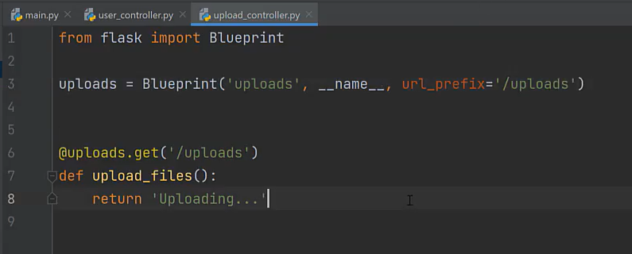
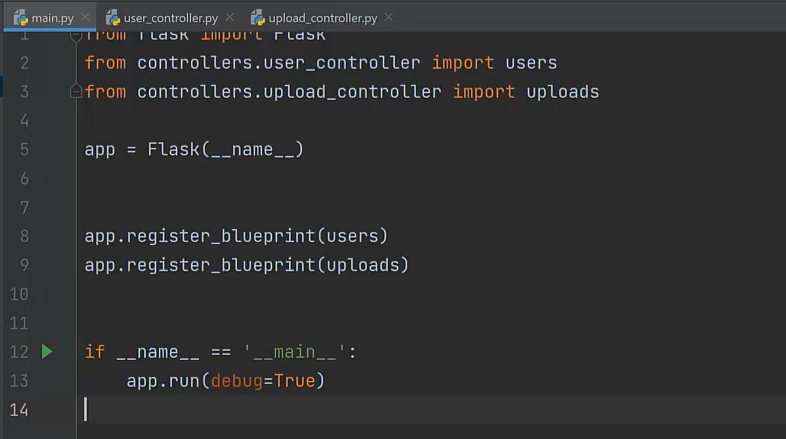


El url_prefix es opcional, sirve para dar una ruta común a todos los endpoints de ese Blueprint.


<hr>

<span id='arquetipo'>

#### Arquetipo

**Estructura inicial**
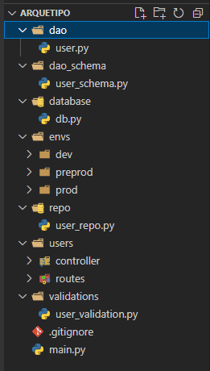

**Dependencias / importaciones:**
<code>pip install 
flask 
flask-sqlalchemy 
flask-marshmallow 
marshmallow-sqlalchemy 
python-dotenv 
flask-cors 
mysqlclient *existe otro mysql-client pero no funciona en este caso*</code>


**Configuración de las variables de entorno, configuración de la base de datos y cadena de conexión**
Los archivos .env (también conocidos como archivos de configuración) son archivos de texto que se utilizan para almacenar variables de entorno. En un proyecto de Python-Flask, los archivos .env se utilizan para definir variables de entorno específicas para un entorno de implementación particular (por ejemplo, variables de configuración de bases de datos, claves de API, contraseñas, etc.). Los archivos .env son una forma segura y conveniente de administrar las variables de entorno, ya que no es necesario almacenarlas en el código fuente de la aplicación y se pueden mantener separadas del código.

Ficheros modificados:
- */dev/.env*
- */dev/dev_env.py*
- *main. py*

*En la cadena de conexión de la imagen falta se podría añadir el modulo pymysql*:

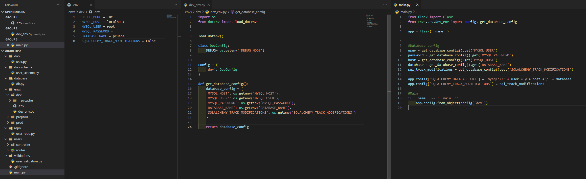


**Configuración de la base de datos**
Aquí realizamos las configuraciones de la base de datos. Creación de las tablas, mapeo del objeto y sus características y realizamos un schema con *Marshmallow* que nos va a permitir serializar los objetos que recuperamos y transformarlos directamente en JSON.
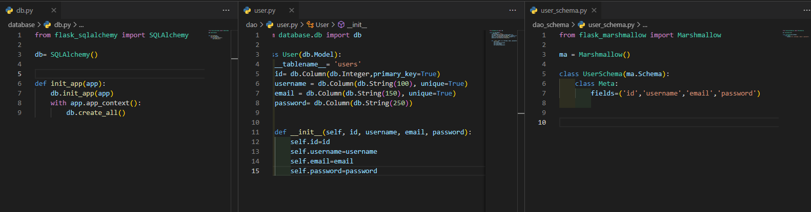

Esta es la estructura básica de una petición GET. El user repo hace la consulta a la base de datos a través de los métodos de SQLAlchemy. La información recuperada es pasada al controlador que a través de los *schemas* que defina serializa la información gracias a los métodos *Marshmallow* y por último el retorno de esta función es pasada a la ruta que nos las devuelve ya en formato JSON.

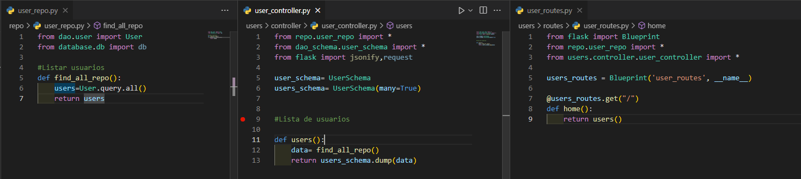

Tras realizar estas configuraciones así es como quedaría el *main. py* de nuestra aplicación

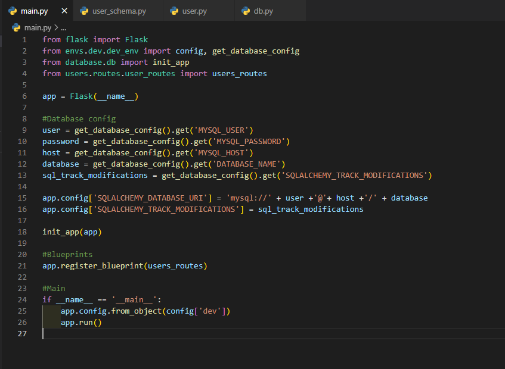

**get by ID & get by username:**
Lo más llamativo de esta parte es ir pasando el id de una función a otra y la función para buscar por username, que necesita ir recogiendo los datos en un diccionario a través de un bucle.

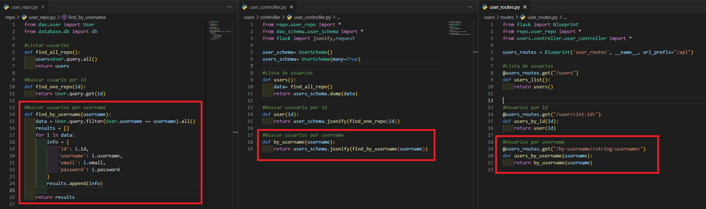


**Método Post**
Recuperamos cada uno de los valores que queremos guardar con el request 
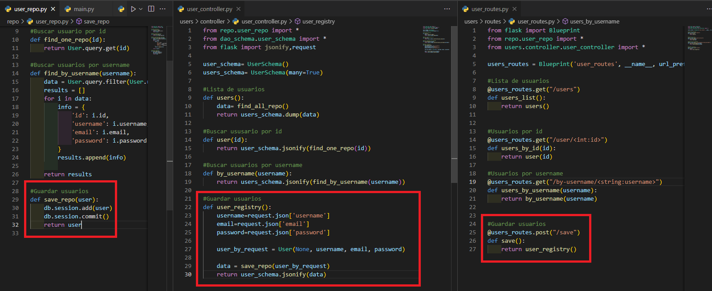

**Método Put**
Similar al POST. Recuperamos el id del que queremos modificar, le asignamos unos nuevos valores y lo mandamos a la BD.
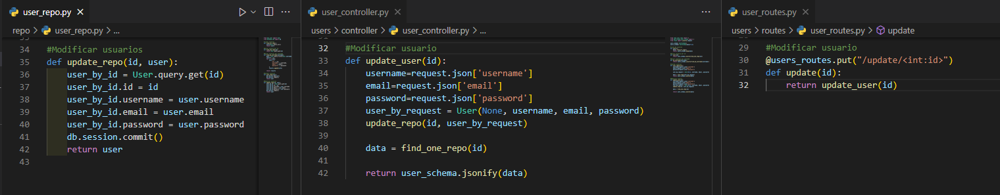

**Método Delete**
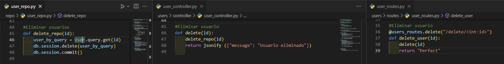


<span id='habilitarCors'>

**Habilitar CORS**

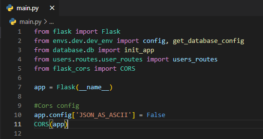


<hr>

<span id='relacionesTablas'>

#### Relaciones entre tablas

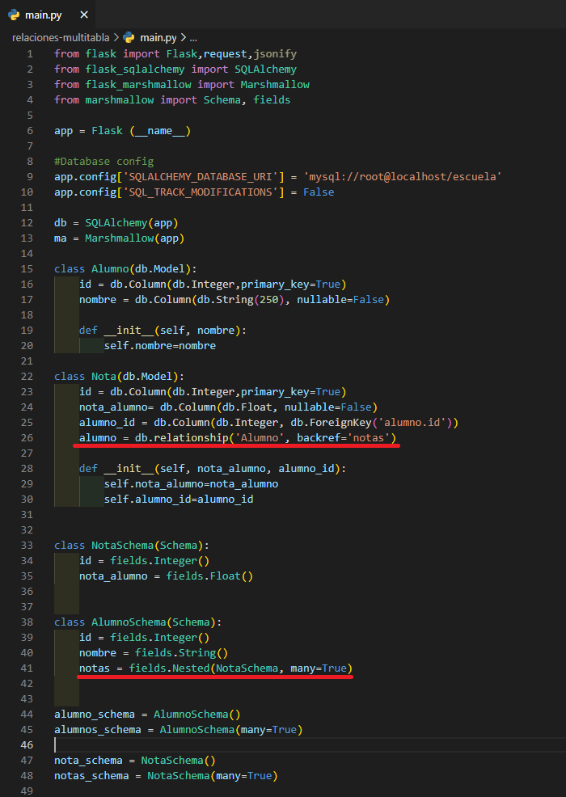


En este caso, la línea de código establece una relación de muchos a uno entre la tabla Nota y la tabla Alumno. Lo que esto significa es que muchos registros (o filas) en la tabla Nota pueden estar asociados a un solo registro en la tabla Alumno.

En otras palabras, un estudiante puede tener muchas notas en la tabla Nota, pero en la tabla Alumno solo habrá una fila asociada a ese estudiante.

En resumen, la línea de código `alumno = db.relationship('Alumno', backref='notas')` establece que muchos registros en la tabla Nota pueden estar asociados a un solo registro en la tabla Alumno, permitiendo acceder a las notas de un estudiante a través de la tabla Alumno.


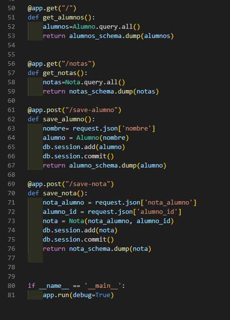

Se definen cuatro rutas en la aplicación Flask que permiten interactuar con los datos en la base de datos. Las rutas get_alumnos y get_notas devuelven todos los alumnos o notas almacenados en la base de datos, respectivamente. Las rutas save_alumno y save_nota permiten agregar nuevos alumnos o notas a la base de datos. Las solicitudes POST para save_nota incluyen un JSON que debe incluir la calificación nota_alumno y el alumno_id asociado a la tabla Alumno.

<span>

<hr>

<span id='hashLogin'>

#### Hasheo de contraseñas y verificación de login

Este apartado no tiene mucho misterio. Solo debemos importar la librería para hacer el hash y el check y cuando se envíen las contraseñas a la base de datos estas deben ser hasheadas y al recuperarlas verificadas.

```python
from flask import Flask, request, jsonify
from flask_sqlalchemy import SQLAlchemy
from flask_marshmallow import Marshmallow
from werkzeug.security import generate_password_hash, check_password_hash #Librerias para hashear y verificar

app = Flask(__name__) 

app.config['SQLALCHEMY_DATABASE_URI'] = "mysql+pymysql://root@localhost/login"

db = SQLAlchemy(app)
ma = Marshmallow(app)


class User(db.Model):
    __tablename__= 'users' #Cambio del mapeo de la tabla user a users en plural
    id = db.Column(db.Integer, primary_key=True)
    username = db.Column(db.String(150))
    password = db.Column(db.String(160))
    
    def __init__(self, username, password):
        self.username = username
        self.password = password

class UserSchema(ma.Schema):
    class Meta:
        fields = ('id','username', 'password')
        
with app.app_context():
    db.create_all()  
        
user_schema = UserSchema()
users_schema = UserSchema(many=True)


@app.post("/save-user")
def save_user():
    username = request.json['username']
    password= request.json['password']
    
    password_hash = generate_password_hash(password) #Hasheado de la contraseña
    
    user = User(username, password_hash) #Envio de la contraseña hasheada
    
    db.session.add(user)
    db.session.commit()
    return user_schema.dump(user)


@app.post('/login')
def login():
    username = request.json['username']
    password= request.json['password']
    
    user = User.query.filter_by(username = username).one_or_none()  #Checkeo para ver primero si existe el usuario
    
    if user is not None and check_password_hash(user.password, password): #Si este existe se comprueba que la contraseña coincida con el hash
        return jsonify({'success': 'usuario autorizado'})

    else: 
        return jsonify({'error':'unauthorized'})    


if __name__ == '__main__':
    app.run(debug=True)
```


<hr>

<span id='jwt'>

#### JWT (Session Tokens)

*Tutorial paso a paso en [JWT](https://github.com/BraisSO/BraisPedia/blob/main/JWT.md) y prueba con POSTMAN*.

```python

from flask import Flask, request, jsonify
from flask_sqlalchemy import SQLAlchemy
from flask_marshmallow import Marshmallow
from werkzeug.security import generate_password_hash, check_password_hash 
from flask_jwt_extended import JWTManager, create_access_token, jwt_required, get_jwt_identity #Importes para la reación y verificación de los tokens


app = Flask(__name__) 
app.config['JWT_SECRET_KEY'] = 'clave_secreta' #Clave secreta (?)

app.config['SQLALCHEMY_DATABASE_URI'] = "mysql+pymysql://root@localhost/login"

db = SQLAlchemy(app)
ma = Marshmallow(app)
jwt= JWTManager(app) #Instanciación de JWT


class User(db.Model):
    __tablename__= 'users'
    id = db.Column(db.Integer, primary_key=True)
    username = db.Column(db.String(150))
    password = db.Column(db.String(160))
    
    def __init__(self, username, password):
        self.username = username
        self.password = password

class UserSchema(ma.Schema):
    class Meta:
        fields = ('id','username', 'password')
        
with app.app_context():
    db.create_all()  
        
user_schema = UserSchema()
users_schema = UserSchema(many=True)


@app.post("/save-user")
def save_user():
    username = request.json['username']
    password= request.json['password']
    
    password_hash = generate_password_hash(password)
    
    user = User(username, password_hash) 
    
    db.session.add(user)
    db.session.commit()
    return user_schema.dump(user)


@app.post('/login')
def login():
    username = request.json['username']
    password= request.json['password']
    
    user = User.query.filter_by(username = username).one_or_none() 
    
    if user is not None and check_password_hash(user.password, password): 
        access_token = create_access_token(identity=username) #Si el login es correcto se crea el token y se asocia a un usuario
        return jsonify({access_token: access_token},200) #Retorno de dicho token 

    else: 
        return jsonify({'error':'unauthorized'})    
    

@app.get('/protected')
@jwt_required() #Le decimos que para acceder a esta ruta es necesario el token
def protected():
    current_user = get_jwt_identity() #Recuperamos el usuario asociado a traves del gestor del propio gestor de tokens
    return jsonify(logged_in_as=current_user)

if __name__ == '__main__':
    app.run(debug=True)
```

En el código, se utiliza JWT (JSON Web Token) para autenticar y autorizar a los usuarios que utilizan la API. JWT es un estándar abierto basado en JSON para crear tokens de acceso que se pueden utilizar para autenticar a los usuarios. Un token JWT contiene información del usuario y se firma digitalmente para garantizar su autenticidad.

Para utilizar JWT en Flask, se importa la extensión "flask_jwt_extended" y se crea un objeto JWTManager. Luego, se puede decorar una función de vista con la función "jwt_required" para proteger esa ruta y asegurarse de que el usuario esté autenticado y tenga un token JWT válido antes de permitir el acceso.

Por último, la función "create_access_token" para generar un token JWT cuando se autentica un usuario correctamente en la ruta de inicio de sesión. Este token se devuelve al usuario en la respuesta para que lo use en futuras solicitudes que requieran autenticación. También se utiliza la función "get_jwt_identity" para recuperar la identidad del usuario asociada con el token JWT en la ruta protegida.


<hr>

<span id='headers'>

#### Headers
La librería *requests* de python ya nos da configurados los headers para realizar las peticiones. Si queremos modificar los mismo debemos configurar los parametros que deseemos y pasarlos en la petición después de la URL. 

Una vez el servidor nos devuelve una respuesta con
`resp_obj.headers` accederíamos a los headers que nos devuelve la API, mientras que con `resp_obj.request.headers` accedemos a los que tiene configurados nuestra petición.

#### Peticiones Head & Options

**Head Request:** Sirve para comprobar el contenido de los endpoints antes de realizar un get. Se accede a través de los headers, ya que el cuerpo de la petición retornará vacío.

**Options Request:** Sirve para comprobar la configuración de los endpoints (operaciones disponibles, CORS, etc.). Al igual que la *head request* el cuerpo de la petición retornará vacío y se accederá a través del header.ç


<span id='tratamientoRespuestas'>

#### Manejo de imágenes - respuesta de bytes**
```
from PIL import Image
from io import BytesIO

```
"**PIL**" (Python Imaging Library) es una biblioteca de Python que se utiliza para trabajar con imágenes. Proporciona una amplia gama de funciones y métodos para abrir, manipular y guardar imágenes de varios formatos.

El módulo "**Image**" es uno de los módulos principales de PIL y proporciona una clase Image que se utiliza para representar una imagen. La clase Image tiene muchos métodos útiles, como "resize", "rotate", "crop", "paste", "save", entre otros, que se pueden usar para manipular imágenes.

El módulo "**BytesIO**" proporciona una forma conveniente de trabajar con datos binarios en Python. Específicamente, se utiliza para trabajar con datos de bytes en memoria en lugar de almacenarlos en disco. Puede crear un objeto BytesIO, escribir datos binarios en él y luego leerlos en memoria, todo sin tener que escribirlos en disco.


#### Manejo de las respuestas y envíos (JSON)
`
import json
`

La función "**json()**" en Python es un método que se utiliza para decodificar datos en formato JSON a objetos Python. El formato JSON (JavaScript Object Notation) se utiliza para intercambiar datos entre aplicaciones web y móviles. La función "json()" toma un objeto JSON como entrada y devuelve un objeto Python.

 Aunque **los datos en formato JSON** pueden ser leídos por un humano, **no son directamente utilizables por un programa en Python**. Por lo tanto, necesitas decodificar los datos JSON para convertirlos en objetos Python que puedan ser manipulados por tu código.

Por ejemplo, si tienes un servicio web que devuelve datos en formato JSON, necesitarás decodificarlos para utilizarlos en tu programa. Una vez que los datos se hayan decodificado en objetos Python, podrás acceder a ellos y manipularlos utilizando las funciones y métodos de Python.

Del mismo modo, si deseas enviar datos desde tu programa Python a un servicio web, necesitarás codificarlos en formato JSON. La función "json.dumps()" se utiliza para codificar objetos Python en formato JSON antes de enviarlos a través de una solicitud HTTP o un servicio web.

En resumen, la conversión entre objetos JSON y objetos Python es necesaria para facilitar la comunicación entre aplicaciones que utilizan diferentes formatos de datos. La función "json()" en Python es una herramienta útil que te permite convertir datos JSON en objetos Python y viceversa.


<span id='codigosEstado'>

#### Status Codes
Códigos de estado más comunes:

**200 OK:** Este es el código de estado HTTP estándar para una respuesta exitosa. Indica que la solicitud se ha completado correctamente y que el servidor ha devuelto los datos solicitados.

**400 Bad Request:** Este código de estado indica que la solicitud enviada al servidor es incorrecta o incompleta. Puede deberse a que la solicitud no cumple con el formato esperado o porque falta información necesaria para procesar la solicitud.

**401 Unauthorized:** Este código de estado indica que la solicitud requiere autenticación y que el usuario no ha proporcionado credenciales válidas. Esto puede suceder, por ejemplo, cuando intentas acceder a una API que requiere un token de autenticación válido.

**403 Forbidden:** Este código de estado indica que el servidor ha entendido la solicitud, pero se niega a procesarla. Puede deberse a que el usuario no tiene los permisos necesarios para acceder a los datos solicitados.

**404 Not Found:** Este código de estado indica que el servidor no pudo encontrar el recurso solicitado. Puede deberse a que la URL es incorrecta o que el recurso no existe.

**500 Internal Server Error:** Este código de estado indica que el servidor ha encontrado un error interno mientras procesaba la solicitud. Puede deberse a problemas en el servidor o en la aplicación que se está ejecutando en el servidor.

**503 Service Unavailable:** Este código de estado indica que el servidor no está disponible en este momento. Puede deberse a que el servidor está sobrecargado o en mantenimiento.

**Como manejar códigos de estado:**

Cuando realizas una solicitud HTTP utilizando la biblioteca "requests" de Python, es posible que desees manejar las excepciones que puedan ocurrir, como errores de red o errores en la respuesta del servidor. Una forma de hacer esto es mediante el uso de la función "**raise_for_status()**" de "requests".

La función "raise_for_status()" verifica si la respuesta de la solicitud HTTP indica un error y, de ser así, lanza una excepción. Si la respuesta no indica un error, la función no hace nada y la ejecución continúa normalmente.

```python
import requests
from requests import exceptions #Metodos y propiedades para manejar excepciones

url = 'https://jsonplaceholder.typicode.com/todos/999'

try:
    response = requests.get(url)
    response.raise_for_status()
except requests.exceptions.HTTPError as error:
    if response.status_code == 400:
        print(f'Error 400: Solicitud malformada: {error}')
    elif response.status_code == 401:
        print(f'Error 401: No autorizado: {error}')
    elif response.status_code == 404:
        print(f'Error 404: Recurso no encontrado: {error}')
    else:
        print(f'Error {response.status_code}: {error}')
except requests.exceptions.RequestException as error:
    print(f'Error en la conexión: {error}')
else:
    print('La solicitud fue exitosa')
    print(response.json())

```

<span id='redirecciones'>

#### Redirecciones
Las redirecciones son respuestas del servidor que indican al cliente que la página web solicitada se ha movido a otra dirección. Esto puede ocurrir por varias razones, como cambios en la estructura de la URL, cambios en la ubicación de los recursos, entre otros.

Para comprobar si nuestra petición ha sido redireccionada y ver el historial de redirecciones lo hacemos de la siguiente manera:

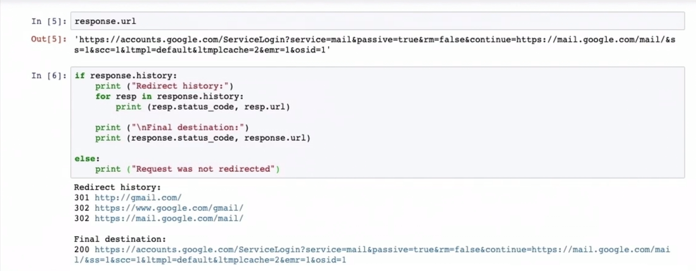

Para evitar que nuestra petición original no sufra redirecciones lo indicaremos en la petición GET de la siguiente manera:

`response = response.get('URL', allow_redirects=False)`


<span id='timeouts'>

#### Timeouts

Los timeouts son mecanismos que se utilizan para limitar el tiempo de espera de una solicitud HTTP antes de que se produzca un error de tiempo de espera. Esto es importante porque algunas solicitudes pueden tardar mucho tiempo en ser completadas y pueden causar problemas si el cliente está esperando indefinidamente por una respuesta.

Por ejemplo, si realizas una solicitud HTTP GET a un servidor que está inactivo o no responde, es posible que el cliente espere indefinidamente por una respuesta y se bloquee. Al establecer un tiempo de espera, se garantiza que la solicitud se interrumpa después de un período de tiempo determinado y el cliente reciba una respuesta de error.

```python
import requests

try:
    response = requests.get('https://api.example.com/calculate', timeout=5)
    # Procesar la respuesta aquí
except requests.exceptions.Timeout:
    # Manejar la excepción de tiempo de espera aquí
    print("Se ha agotado el tiempo de espera para la solicitud.")
```

**El tiempo que indicamos en la petición corresponde con el tiempo que el servidor tarda en comenzar a dar la respuesta, no el tiempo en el que se completa la misma.**

Si queremos indicar un tiempo en el que se debe completar la lectura de la petición debemos indicarlo añadiendo un segundo parametro:

`response = requests.get('https://api.example.com/calculate', timeout=5,18)`

Para eliminar cualquier tipo de timeout:
`timeout=None`


<hr>

<span id='unitTesting'>

#### Unit Testing 

En Flask, se utilizan bibliotecas de pruebas como "unittest" o "pytest" para escribir y ejecutar pruebas unitarias. A continuación, se presentan algunos ejemplos de pruebas unitarias que se pueden realizar en una aplicación Flask:

**Prueba de funciones:** Se pueden realizar pruebas de las funciones de la aplicación para asegurarse de que se comportan de acuerdo con las especificaciones. Por ejemplo, si tienes una función que calcula el promedio de una lista de números, puedes escribir una prueba que compruebe que el resultado devuelto es el esperado:

```python
def test_average():
    assert average([1, 2, 3, 4, 5]) == 3
    assert average([2, 2, 2, 2]) == 2
    assert average([0] == 0)
```
**Prueba de rutas:** Se pueden realizar pruebas para asegurarse de que las rutas de la aplicación funcionan correctamente y devuelven las respuestas adecuadas. Por ejemplo, si tienes una ruta que devuelve una lista de usuarios, puedes escribir una prueba que compruebe que la ruta devuelve la lista de usuarios esperada:

```python
def test_get_users():
    response = client.get('/users')
    assert response.status_code == 200
    assert len(response.json()) == 3
```
**Prueba de validación de entrada:** Se pueden realizar pruebas para asegurarse de que la aplicación maneje correctamente la validación de entrada y devuelva los errores adecuados en caso de que se proporcionen datos de entrada incorrectos. Por ejemplo, si tienes una ruta que espera un número de identificación de usuario como entrada, puedes escribir una prueba que compruebe que la ruta devuelve un error 400 si se proporciona un identificador de usuario no válido:

```python
def test_invalid_user_id():
    response = client.get('/users/abc')
    assert response.status_code == 400
```

En las pruebas unitarias, la sintaxis que deberías conocer en Python es la siguiente:

**assert:** La sentencia assert se utiliza para verificar que una afirmación es verdadera. Si la afirmación es falsa, la sentencia genera una excepción AssertionError y la prueba falla.

**setUp:** El método setUp se utiliza para realizar cualquier configuración necesaria antes de que se ejecute cada prueba.

**tearDown:** El método tearDown se utiliza para realizar cualquier limpieza necesaria después de que se ejecuta cada prueba.

```python
import unittest
from mymodule import add_numbers

class TestAddNumbers(unittest.TestCase):
    def setUp(self):
        self.numbers = [1, 2, 3, 4, 5]

    def tearDown(self):
        del self.numbers

    def test_add_numbers(self):
        result = add_numbers(self.numbers)
        self.assertEqual(result, 15)

    def test_add_negative_numbers(self):
        numbers = [-1, -2, -3]
        result = add_numbers(numbers)
        self.assertEqual(result, -6)

    def test_add_float_numbers(self):
        numbers = [1.5, 2.5, 3.5]
        result = add_numbers(numbers)
        self.assertEqual(result, 7.5)

if __name__ == '__main__':
    unittest.main()
```

Si deseas agregar un **mock** a tus pruebas unitarias en Flask, puedes utilizar la biblioteca ***unittest.mock*** de Python, que proporciona una forma de simular objetos y funciones.

Por ejemplo, supongamos que tienes una aplicación Flask que hace una solicitud a una API externa utilizando la función requests.get(). Si deseas probar la función que llama a requests.get(), pero no deseas realizar una solicitud real a la API externa durante la prueba, puedes utilizar un mock de la función requests.get() para simular la respuesta de la API externa.

A continuación, se presenta un ejemplo de cómo agregar un mock a una prueba unitaria en Flask utilizando unittest.mock:

```python
import unittest
from unittest.mock import patch
from myapp import app, get_data_from_api

class TestGetDataFromAPI(unittest.TestCase):
    def setUp(self):
        self.app = app.test_client()

    def tearDown(self):
        pass

    @patch('myapp.requests.get')
    def test_get_data_from_api(self, mock_get):
        mock_get.return_value.json.return_value = {'data': 'example'}
        response = self.app.get('/api')
        self.assertEqual(response.status_code, 200)
        self.assertEqual(response.json, {'data': 'example'})

if __name__ == '__main__':
    unittest.main()
```
En este ejemplo, se utiliza el decorador **@patch** para crear un mock de la función requests.get() en la función test_get_data_from_api. La función mock_get se pasa como argumento al método de prueba, y se utiliza para simular la respuesta de la API externa. La función mock_get.return_value.json.return_value se utiliza para simular la respuesta JSON de la API externa.

<hr>

<span id='dto'>

#### Uso de DTO

```python
from flask import Flask, jsonify, request
from marshmallow import Schema, fields, validate
from my_database import User  # importamos la clase que representa el modelo de la base de datos

app = Flask(__name__)

# Creamos una clase que representa los datos del usuario
class UserDTO:
    def __init__(self, username: str, email: str, password: str):
        self.username = username
        self.email = email
        self.password = password

# Creamos un esquema de Marshmallow para validar los datos del usuario
class UserSchema(Schema):
    username = fields.Str(required=True)
    email = fields.Email(required=True)
    password = fields.Str(required=True, validate=validate.Length(min=6))

# Creamos una función que convierte un objeto User en un objeto UserDTO
def user_to_dto(user: User) -> UserDTO:
    return UserDTO(username=user.username, email=user.email, password='')

# Creamos una función que convierte un objeto UserDTO en un objeto User
def dto_to_user(dto: UserDTO) -> User:
    return User(username=dto.username, email=dto.email, password=dto.password)

# Creamos una ruta que crea un nuevo usuario
@app.route('/users', methods=['POST'])
def create_user():
    data = request.json
    user_schema = UserSchema()
    errors = user_schema.validate(data)
    if errors:
        return jsonify({'error': errors}), 400
    user_dto = UserDTO(**data)
    user = dto_to_user(user_dto)
    # guardar el usuario en la base de datos
    db.session.add(user)
    db.session.commit()
    user_dto = user_to_dto(user)
    return jsonify({'user': user_dto.__dict__}), 201

# Creamos una ruta que obtiene un usuario por su ID
@app.route('/users/<int:user_id>', methods=['GET'])
def get_user(user_id):
    user = User.query.get(user_id)
    if user:
        user_dto = user_to_dto(user)
        return jsonify({'user': user_dto.__dict__})
    else:
        return jsonify({'error': 'User not found'}), 404
```

En este ejemplo, se ha combinado la clase que representa el modelo de la base de datos (User) con un DTO (UserDTO) para encapsular y validar los datos que se reciben en la petición HTTP. También se ha utilizado un esquema de Marshmallow (UserSchema) para validar los datos del DTO antes de ser procesados por la aplicación. Además, se han creado dos funciones (user_to_dto y dto_to_user) para convertir los objetos de un tipo a otro.

En la ruta /users se crea un nuevo usuario a partir de un objeto UserDTO y se guarda en la base de datos como un objeto User. Luego se convierte el objeto User en un objeto UserDTO para enviar como respuesta HTTP.

En la ruta /users/<.int:user_id> se obtiene un usuario de la base de datos a través de su ID y se convierte en un objeto UserDTO para enviar como respuesta HTTP. Si el usuario no se encuentra en la base de datos, se devuelve un error 404.

<hr>

#### Flechas y Lambdas

<span id='flechasylambdas'>

**Flechas**
Las flechas (->) en las funciones de Python se utilizan para indicar el tipo de retorno de la función. Esto se conoce como "anotación de tipo" y es una característica introducida en Python 3.5 para ayudar a mejorar la legibilidad del código y permitir a los editores y herramientas de desarrollo proporcionar una mejor ayuda para la escritura de código.

La sintaxis para la anotación de tipo es colocar una flecha (->) seguida del tipo de retorno deseado después de los argumentos de la función. Por ejemplo:

```python
def suma(a: int, b: int) -> int:
    return a + b
```

En este ejemplo, la función suma toma dos argumentos a y b, ambos de tipo int, y devuelve un valor de tipo int.

Es importante tener en cuenta que la anotación de tipo en Python es opcional y no afecta la funcionalidad de la función. Es simplemente una ayuda para la legibilidad del código y para los editores y herramientas de desarrollo. Además, las anotaciones de tipo no se verifican en tiempo de ejecución, por lo que es posible que una función pueda devolver un valor de un tipo diferente al anotado.


**Lambdas**
Las lambdas en Python son funciones anónimas que se pueden definir en una sola línea de código y se utilizan para realizar operaciones simples en los datos. Las lambdas son útiles para crear funciones rápidas y pequeñas que se utilizarán en un lugar específico de la aplicación.

La sintaxis básica de una lambda en Python es la siguiente:

```python
suma = lambda x, y: x + y
```
En este ejemplo, la lambda se asigna a la variable suma, y se puede llamar como una función normal:

```python
resultado = suma(3, 4)
print(resultado) # salida: 7
```

Las lambdas son particularmente útiles cuando se utilizan en conjunto con funciones que toman funciones como argumentos. Por ejemplo, la función sorted de Python toma una función de comparación como argumento, y se puede proporcionar una lambda para hacer una comparación personalizada. Aquí hay un ejemplo:

```python
lista = [('Juan', 30), ('Ana', 25), ('Pedro', 35)]

# ordenar la lista por la edad en orden ascendente
lista_ordenada = sorted(lista, key=lambda x: x[1])

print(lista_ordenada) # salida: [('Ana', 25), ('Juan', 30), ('Pedro', 35)]
```

En este ejemplo, se utiliza una lambda para seleccionar el segundo elemento de cada tupla en la lista, que es la edad. Luego se utiliza esta lambda como la clave para ordenar la lista.

<hr>

<span id='serializacion'>

#### Serialización
```python
from flask_marshmallow import Marshmallow

class UserSchema(ma.Schema):
    class Meta:
        fields = ('id', 'username', 'email')
```

Por otro lado, Schema() es una clase que se importa directamente desde el paquete marshmallow. Es utilizado cuando no estamos trabajando con una aplicación de Flask, y necesitamos crear un esquema en Python de manera independiente. Para usar Schema(), simplemente importamos la clase y la utilizamos de la siguiente manera:


```python
from marshmallow import Schema, fields

class UserSchema(Schema):
    id = fields.Int()
    username = fields.Str()
    email = fields.Email()
```

En resumen, podemos utilizar ma.Schema cuando estamos trabajando con una aplicación de Flask y queremos crear un esquema de serialización y deserialización de manera rápida. Por otro lado, Schema() se utiliza cuando necesitamos crear un esquema en Python de manera independiente, sin necesidad de utilizar la funcionalidad de Flask.

<hr>

<span id='subida'>

#### Subida de archivos (con *chunks*)

Este código contiene un formulario HTML para la subida de multiples archivos que se enviarán a una API que se encargará del manejo y guardado de los mismos.

```html
<!DOCTYPE html>
<html>

<head>
    <meta charset="utf-8">
    <title>Subir archivos</title>
</head>

<body>
    <form method="POST" action="http://localhost:5000/upload" enctype="multipart/form-data">
        <input type="file" name="file" multiple>
        <input type="submit" value="Subir archivos">
    </form>
</body>

</html>
```
Este código implementa un servidor web en Flask que permite subir archivos a través de una API RESTful. El servidor verifica si la carpeta para almacenar los archivos existe, si no, la crea. Luego, los archivos subidos por el usuario se dividen en lotes de tamaño máximo definido por la variable 'batch_size' y se guardan en la carpeta mencionada. Finalmente, el servidor devuelve una respuesta JSON indicando cuántos archivos se subieron y en cuántos lotes se dividió la subida.

```python
from flask import Flask, request, jsonify
import os 

app = Flask(__name__)

def chunks(lst, n):
    #"""Divide una lista en lotes de tamaño n."""
    for i in range(0, len(lst), n):
        yield lst[i:i + n]

@app.route('/upload', methods=['POST'])
def upload():
    if request.method == 'POST':
        # Verificar si la carpeta existe, si no, crearla
        if not os.path.exists('subidaArchivos\\archivos'):
            os.makedirs('subidaArchivos\\archivos')

        # Obtener los archivos
        files = request.files.getlist('file')
        
        #Enviar los archivos por lotes
        batch_size = 10  # Define el tamaño máximo de un lote
        #El número 10 en batch_size representa el tamaño máximo de un lote de archivos que se enviará en una sola petición. 
        #En otras palabras, si el usuario selecciona 30 archivos para subir, estos archivos se dividirán en 3 lotes de 10 archivos cada uno
        batches = list(chunks(files, batch_size))
        total_files = len(files)
        total_batches = len(batches)
        for i, batch in enumerate(batches):
            # Guardar los archivos en la carpeta subidaArchivos\archivos
            for file in batch:
                file.save(os.path.join('subidaArchivos\\archivos', file.filename))
            
        # Devolver una respuesta JSON
        message = f'Se subieron {total_files} archivos en {total_batches} lotes'
        return jsonify({'message': message})
    else:
        return jsonify({'message': 'Solicitud no valida'})

if __name__ == '__main__':
    app.run(debug=True)


```

La función ``enumerate()`` es una función de Python que toma una secuencia iterable (como una lista o una tupla) y devuelve un objeto iterable de pares (índice, elemento) en el que el índice es el número de elementos procesados hasta el momento y el elemento es el elemento correspondiente en la secuencia iterable.

En este código, la función ``enumerate() ``se utiliza para recorrer cada lote de archivos y devolver el índice de cada lote en el bucle for. La variable i contiene el índice del lote actual y la variable batch contiene el conjunto de archivos para ese lote. Esto permite realizar operaciones específicas en cada lote, como guardar los archivos en la carpeta correspondiente.

En resumen, la función ``enumerate()`` se utiliza para obtener el índice de cada lote de archivos y el conjunto de archivos correspondiente para poder procesarlos en el servidor.

<hr>

#### Enlaces de interés

<span id='enlaces'>

 - [Guía completa Flask](https://j2logo.com/tutorial-flask-espanol/)

