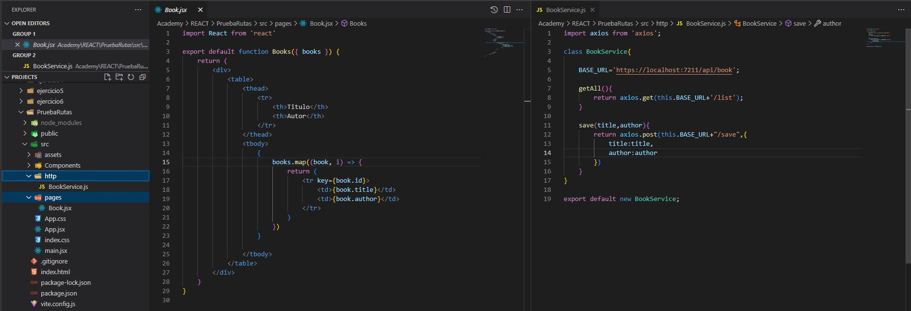

# Crear proyecto React con Vite
Para crear un proyecto de React con la herramienta Vite, sigue estos pasos:

1. Abre una terminal y navega hasta el directorio en el que deseas crear tu proyecto.
2. Ejecuta el comando `npm create vite`.
3. Una vez creado el proyecto, entra en él con el comando `cd [folder]`.
4. Instala las dependencias necesarias con `npm install`.
5. Inicia el servidor de desarrollo con `npm run dev`.

# Segunda manera de crear un proyecto con React
Otra forma de crear un proyecto con React es utilizando el comando `create-react-app`:

1. Abre una terminal y ejecuta el comando `npx create-react-app ejemplo`.
2. Entra en el proyecto con `cd [folder]`.
3. Inicia el servidor con `npm start`.

# Levantar el servidor
Para levantar el servidor, debes ejecutar el script de ejecución especificado en el `package.json` de tu proyecto. Por ejemplo, `npm run [nombre del script de ejecución]`.

# Snippets componentes & otros
Para crear una estructura de componente en React, puedes utilizar las siglas `rfc`, `rfac`, etc.

La **interpolación** en React se realiza con `{}`.

Existen dos tipos de componentes en React: los **componentes de clase y los componentes de función**. Los componentes de clase utilizan la estructura de exportar una clase, mientras que los componentes de función exportan una función.

El **DOM en React se renderiza dos veces**. Para evitar esto, se puede usar `<React.StrictMode>`.

Para utilizar **Bootstrap** en tu proyecto React, debes instalarlo primero con `npm install bootstrap`. Luego, en tu archivo `App.jsx` debes importar el CSS y JS de Bootstrap:
```javascript
// Bootstrap CSS
import "bootstrap/dist/css/bootstrap.min.css";
// Bootstrap Bundle JS
import "bootstrap/dist/js/bootstrap.bundle.min";
```

Los **comentarios** en react se escriben del siguiente modo: 
<code> {/*Esto es un comentario*/}</code>

# Eventos
En React, las funciones deben ser declaradas dentro del componente y no llevan paréntesis.

Hooks es una característica de React que permite utilizar el estado y otras características de los componentes de clase en componentes de función. Para utilizar Hooks, debes importar `useState` en vez de `React`. Luego, puedes crear una constante como esta:

<code>const [counter, setCounter]=useState(0);</code>

# Peticiones HTTP

En React, existen varias librerías populares para realizar peticiones HTTP, como Axios, Fetch, o la librería nativa de JavaScript, XMLHttpRequest. A continuación se presentan algunos ejemplos de cómo se pueden realizar peticiones HTTP en React utilizando Axios.

**Instalando Axios:**

Antes de comenzar a realizar peticiones HTTP, es necesario instalar la librería Axios. Se puede hacer esto ejecutando el siguiente comando en la terminal:


    *npm install axios*

**Realizando una petición GET:**

```javascript
    import { useState, useEffect } from 'react';
    import reactLogo from './assets/react.svg';
    import './App. CSS;
    import axios from 'axios';
    
    function App() {
    const [users, setusers] = useState([])

    useEffect( ( ) => {
    axios get ("https://jsonplaceholder.typicode.com/users")
         .then( res=> setUsers(res. data))
         .catch(error => console.log(error))
         },[])

         return
  ```

   *Imprimir datos petición:*

```html
     <div>
     {
     users.map((user,i) =>{
       return(
         <p key={i}>{user.name} - {user.email}</p>
        )
      })
     }
     </div>
  ```

 *Se añade [] al "useEffect" para terminar el bucle infinito de peticiones. [] -> es un array de dependencias vacío.*

 En este ejemplo, se importa la librería Axios y se utiliza el método `get()` para realizar una petición GET a la URL especificada. El resultado de la petición se almacena en el estado del componente y se utiliza para renderizar los datos en la vista.


**Realizando una petición POST:**
```javascript
    import axios from 'axios';
    import { useState } from 'react';
    import "./Guardar.css"

    export default function Guardar() {
    const [clientes, setClientes] = useState ({
    nombre: '',
    correo: ''
    });

    function handleSubmit(e){
        e.preventDefault();
        axios.post('https://jsonplaceholder.typicode.com/posts', clientes)
        .then(res => {
            console.log(res.data.nombre);
            console.log(res.data.correo);
        });
    }

    return (
        <div className="globalGuardar">
            <h2>Guardar un usuario</h2>
        <form onSubmit={handleSubmit}>
            <input 
                type="text" 
                name="nombre" 
                placeholder='nombre'
                value={clientes.nombre}
                onChange={e => setClientes({ ...clientes,nombre: e.target.value })} 
            ></input>
            <input 
                type="text" 
                name="correo"
                placeholder='correo'
                value={clientes.correo}
                onChange={e => setClientes({ ...clientes,correo: e.target.value })}>  
            </input>
                <button type="submit">Submit</button>
            </form>
            </div>
            );
    }
```

En este ejemplo, se utiliza el método `post()` para realizar una petición POST a la URL especificada. Se crea un objeto `post` con los datos a enviar y se pasa como segundo argumento al método `post()`. El resultado de la petición se puede manejar en la promesa `then()` para realizar cualquier acción necesaria, como mostrar un mensaje de éxito al usuario.

En este ejemplo se usa class en el método POST, pero no es necesario.

##### **Importante:**

Recordar unsar el spread operator cuando asignamos un valor del que vamos a hacer un POST para no sobreescribirlo es decir, quedara algo como: <code>onChange={e => setClientes({ ...clientes,correo: e.target.value })}></code>


# Rutas

**Imports:**

<code>import {Link} from 'react-router-dom'</code>

<code>import {BrowserRouter, Route, Routes} from 'react-router-dom';</code>

**Ejemplo de panel de navegación**:
```javascript
import React from 'react'
import {Link} from 'react-router-dom'

export default function Navigation() {
  return (
      <div>
          <ul>
              <li>
                 <Link to='/navigation'>Inicio</Link>
              </li>
              <li>
                  <Link to='/save'>Guardar</Link>
              </li>
          </ul>
      </div>)
}

```

**App.jsx con rutas**
``` javascript
import './App.css'
import {BrowserRouter, Route, Routes} from 'react-router-dom';
import SaveBooks from './components/SaveBooks';
import NotFound from './Components/NotFound';
import Navigation from './Components/Navigation';


function App() {


  return (
    <div>
      <BrowserRouter>
        <Routes>
          <Route exact path='/navigation' element={<Navigation/>}/>
          <Route exact path='/save' element={<SaveBooks/>}/>
          <Route path='*' element={<NotFound/>}/>
        </Routes>
      </BrowserRouter>
    </div>
  )
}

export default App

```


**Estructura directorios**



